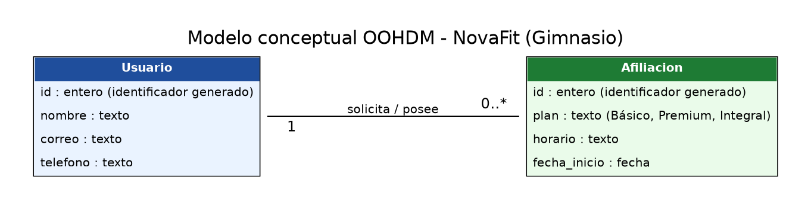
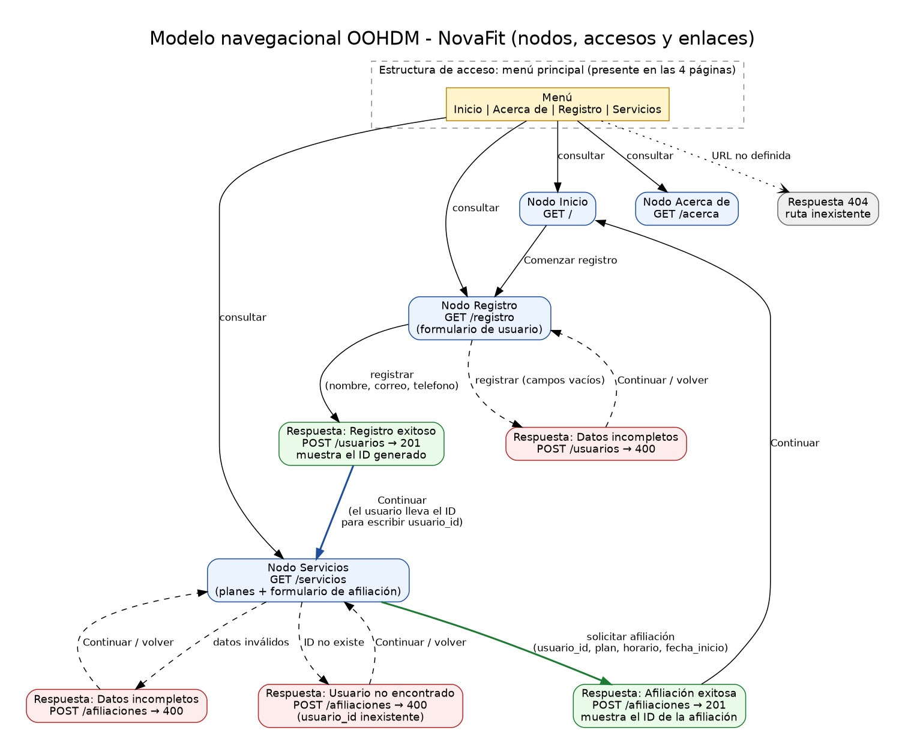
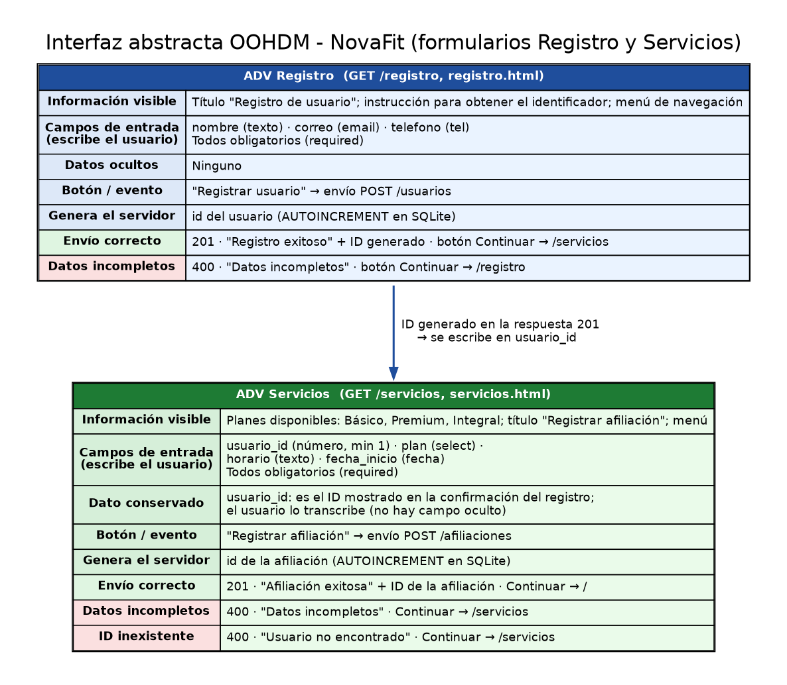
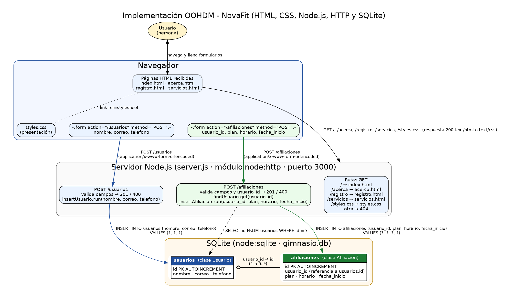

# Documentación OOHDM — NovaFit (Gimnasio)

**Estudiante:** Anwar Joseph Palacios Bejarano
**Asignatura:** Ingeniería Web — Universidad Cooperativa de Colombia
**Plataforma:** Gimnasio (NovaFit) · **Entidad principal:** Usuario · **Operación asociada:** Afiliación

Este documento aplica las cuatro actividades de **OOHDM** (Object-Oriented Hypermedia Design Method) a la plataforma NovaFit. Los nombres de rutas, archivos, tablas y campos son exactamente los del código (`server.js`, `*.html`, `gimnasio.db`).

| Actividad OOHDM | Pregunta | Diagrama | Fuente editable |
|---|---|---|---|
| Diseño conceptual | ¿Qué información maneja la plataforma? | [`01_modelo_conceptual.png`](01_modelo_conceptual.png) | [`.dot`](fuentes_editables/01_modelo_conceptual.dot) |
| Diseño navegacional | ¿Qué nodos visita el usuario? | [`02_modelo_navegacional.png`](02_modelo_navegacional.png) | [`.dot`](fuentes_editables/02_modelo_navegacional.dot) |
| Interfaz abstracta | ¿Qué contiene cada nodo? | [`03_interfaz_abstracta.png`](03_interfaz_abstracta.png) | [`.dot`](fuentes_editables/03_interfaz_abstracta.dot) |
| Implementación | ¿Con qué tecnologías se materializa? | [`04_implementacion.png`](04_implementacion.png) | [`.dot`](fuentes_editables/04_implementacion.dot) |

> Los diagramas también están en SVG (mismo nombre, extensión `.svg`). Las fuentes son archivos Graphviz (`.dot`); se regeneran con `dot -Tpng archivo.dot -o archivo.png`.

---

## 1. Diseño conceptual

**Clases y atributos**

- **Usuario**: `id`, `nombre`, `correo`, `telefono`.
- **Afiliacion**: `id`, `plan`, `horario`, `fecha_inicio`.

**Relación:** un Usuario se relaciona con **0..\*** Afiliaciones (multiplicidad `0..*` del lado de Afiliacion) y cada Afiliacion pertenece a exactamente **1** Usuario.

**Reglas del dominio.** Una persona primero debe existir como Usuario; al registrarse el sistema le asigna un identificador único (`id`). Una Afiliación no puede existir sin un Usuario registrado: por eso se exige el identificador del usuario y se verifica que exista. Un mismo Usuario puede no tener afiliaciones (recién registrado) o tener varias. El plan es uno de Básico, Premium o Integral, y todos los atributos son obligatorios. En el modelo físico, la pertenencia se guarda en el campo `afiliaciones.usuario_id`.

---

## 2. Diseño navegacional

**Nodos:** Inicio (`GET /`), Acerca de (`GET /acerca`), Registro (`GET /registro`), Servicios (`GET /servicios`) y las respuestas del servidor a los envíos (registro exitoso 201, afiliación exitosa 201, datos incompletos 400, usuario no encontrado 400 y ruta inexistente 404).

**Estructuras de acceso:** el **menú principal** (Inicio, Acerca de, Registro, Servicios) presente en las cuatro páginas, el botón *Comenzar registro* en Inicio y el botón *Continuar* de cada respuesta.

**Enlaces / acciones:** consultar (menú), registrar (`POST /usuarios`), solicitar afiliación (`POST /afiliaciones`), volver/continuar (desde las respuestas).

**Contexto e identificador.** El `id` del Usuario se genera al registrarse y se muestra en la respuesta 201 de `POST /usuarios`. La aplicación no usa sesiones ni campos ocultos: el usuario lleva ese ID al nodo Servicios y lo escribe en el campo `usuario_id`, que el servidor valida contra la tabla `usuarios` antes de crear la afiliación.

---

## 3. Diseño de interfaz abstracta

| Elemento | Registro (`registro.html`) | Servicios (`servicios.html`) |
|---|---|---|
| Información visible | Título e instrucción del registro | Planes Básico, Premium, Integral |
| Datos que escribe el usuario | `nombre`, `correo`, `telefono` | `usuario_id`, `plan`, `horario`, `fecha_inicio` |
| Datos ocultos | Ninguno | Ninguno (el ID se conserva de forma manual) |
| Dato generado por el servidor | `id` del usuario | `id` de la afiliación |
| Botón / evento | *Registrar usuario* → `POST /usuarios` | *Registrar afiliación* → `POST /afiliaciones` |
| Envío correcto | 201 «Registro exitoso» + ID | 201 «Afiliación exitosa» + ID |
| Datos incompletos | 400 «Datos incompletos» → vuelve a `/registro` | 400 «Datos incompletos» → vuelve a `/servicios` |
| Caso adicional | — | 400 «Usuario no encontrado» si el ID no existe |

Este modelo describe únicamente contenido, controles y respuestas; los colores y estilos pertenecen a `styles.css` (presentación).

---

## 4. Implementación

- **Navegador:** recibe `index.html`, `acerca.html`, `registro.html`, `servicios.html` y `styles.css`; envía formularios con `method="POST"` (`application/x-www-form-urlencoded`).
- **Servidor Node.js (`server.js`):** módulo `node:http`, puerto 3000. Sirve las rutas GET, valida los datos y responde 201, 400 o 404.
- **SQLite (`gimnasio.db`, módulo `node:sqlite`):** tablas `usuarios` y `afiliaciones`. Todas las consultas son parametrizadas (`?`).

---

## 5. Matriz de correspondencia

| Elemento OOHDM | Ruta o archivo | Tabla o campo | Evidencia funcional |
|---|---|---|---|
| Entidad principal: clase **Usuario** | `POST /usuarios` (`server.js`) | Tabla `usuarios`: `id`, `nombre`, `correo`, `telefono` | Registro almacenado e ID generado (201) |
| Operación: clase **Afiliacion** | `POST /afiliaciones` (`server.js`) | Tabla `afiliaciones`: `id`, `usuario_id`, `plan`, `horario`, `fecha_inicio` | Afiliación asociada mediante `usuario_id` (201) |
| Relación 1 a 0..* | Validación `findUsuario` en `POST /afiliaciones` | `afiliaciones.usuario_id` → `usuarios.id` | ID inexistente ⇒ 400 «Usuario no encontrado» |
| Nodo Inicio | `GET /` · `index.html` | No aplica | Página principal presentada |
| Nodo Acerca de | `GET /acerca` · `acerca.html` | No aplica | Página informativa presentada |
| Nodo Registro | `GET /registro` · `registro.html` | No aplica | Formulario presentado |
| Nodo Servicios | `GET /servicios` · `servicios.html` | No aplica | Planes y formulario presentados |
| Estructura de acceso: menú | `<nav>` en los 4 HTML | No aplica | Enlaces a `/`, `/acerca`, `/registro`, `/servicios` |
| Evento de envío de registro | `POST /usuarios` | `INSERT INTO usuarios (nombre, correo, telefono) VALUES (?, ?, ?)` | Respuesta 201 con ID |
| Evento de envío de afiliación | `POST /afiliaciones` | `INSERT INTO afiliaciones (usuario_id, plan, horario, fecha_inicio) VALUES (?, ?, ?, ?)` | Respuesta 201 con ID |
| Comprobación de existencia | `POST /afiliaciones` | `SELECT id FROM usuarios WHERE id = ?` | 400 si no existe |
| Datos incompletos | Función `valid()` en `server.js` | Campos vacíos | Respuesta 400 |
| Presentación visual (fuera de OOHDM-ADV) | `GET /styles.css` · `styles.css` | No aplica | Hoja de estilos cargada |
| Ruta inexistente | Cualquier otra ruta | No aplica | Respuesta 404 |

---

## 6. Ajustes realizados después del modelado

- **Código de la aplicación:** el modelado no reveló inconsistencias entre diagramas, rutas, formularios y tablas; `server.js`, los HTML y la base de datos **no se modificaron**.
- **Organización del repositorio:** `styles.css` quedaba fuera de la carpeta del proyecto en el empaquetado anterior; se colocó junto a `server.js`, que es donde el servidor la busca.
- **Nombre de la base de datos:** el proyecto usa `gimnasio.db` (no `proyecto.db`); se conserva para mantener los mismos datos de la práctica anterior y la documentación usa ese nombre.
- **Identificador entre nodos:** el ID no se traslada automáticamente al formulario de Servicios; el modelo lo refleja tal como funciona (transcripción manual).

## 7. Cómo comprobar la correspondencia

1. Ejecutar `node server.js` y abrir `http://localhost:3000`.
2. Registrar un usuario en `/registro` → respuesta 201 con el ID (modelos 1, 2 y 3).
3. Usar ese ID en `/servicios` → respuesta 201 con el ID de la afiliación.
4. Probar un ID inexistente o campos vacíos → respuestas 400.
5. Revisar en la terminal las líneas `POST /usuarios`, `POST /afiliaciones` y en `gimnasio.db` las filas relacionadas por `usuario_id`.
